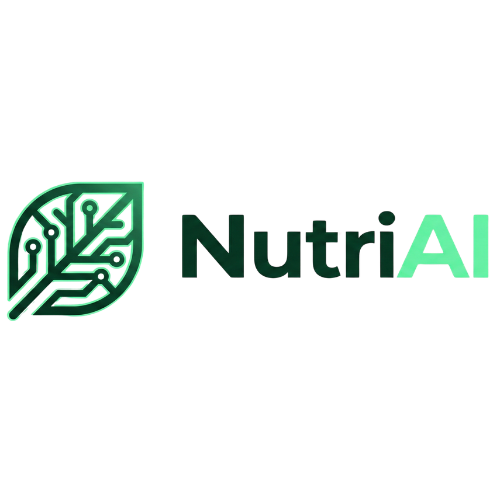
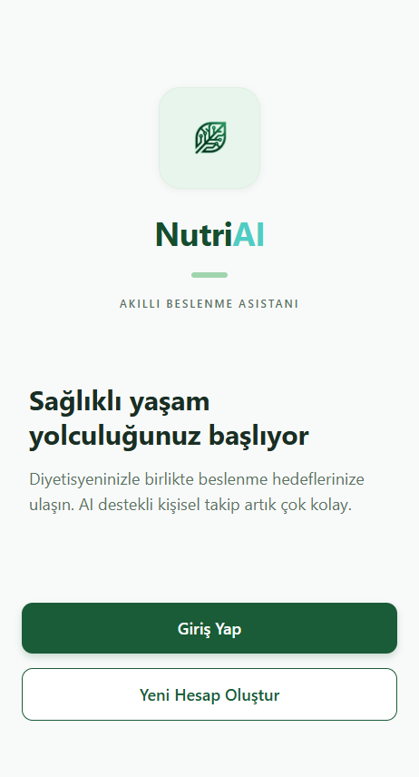
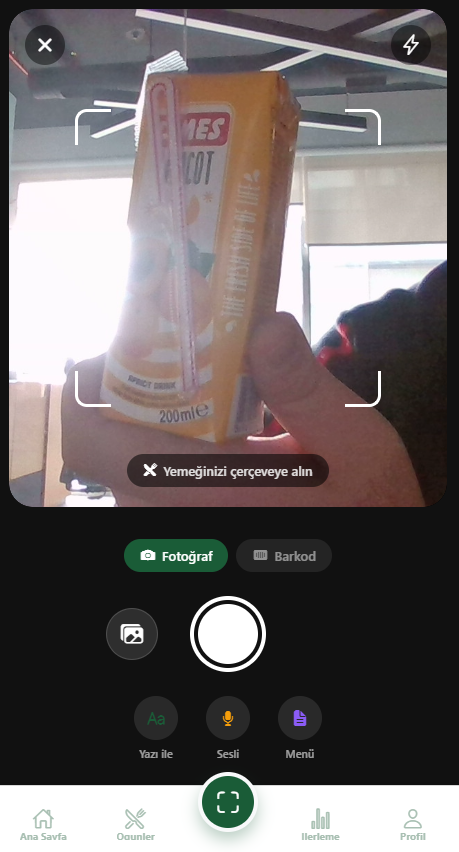
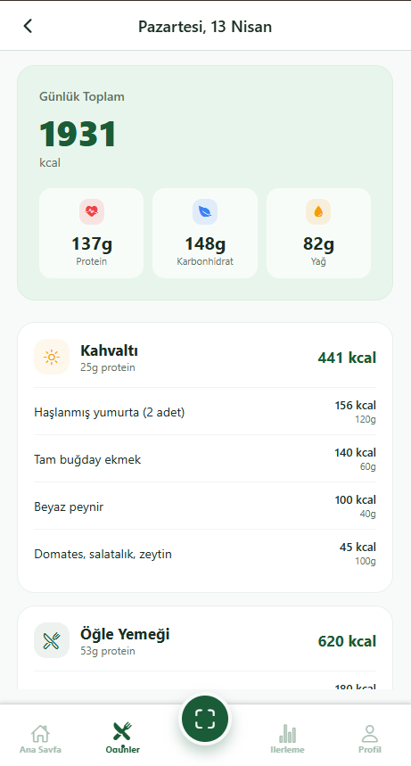
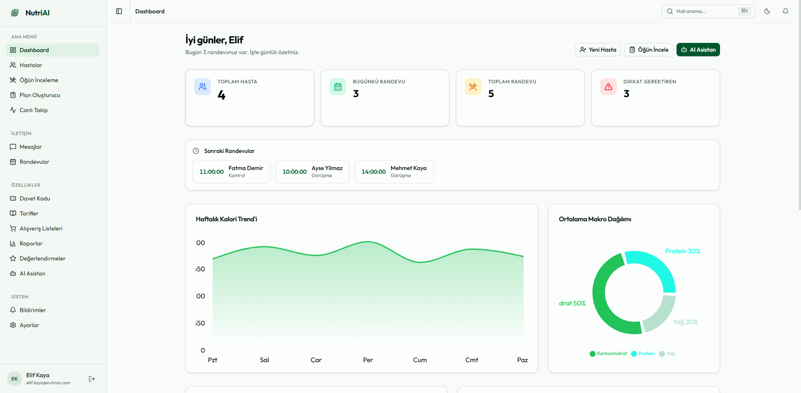
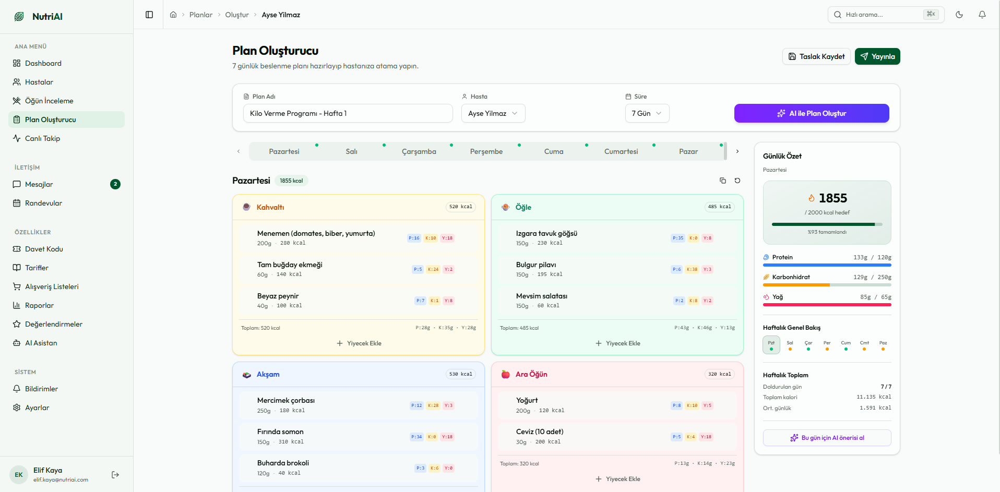
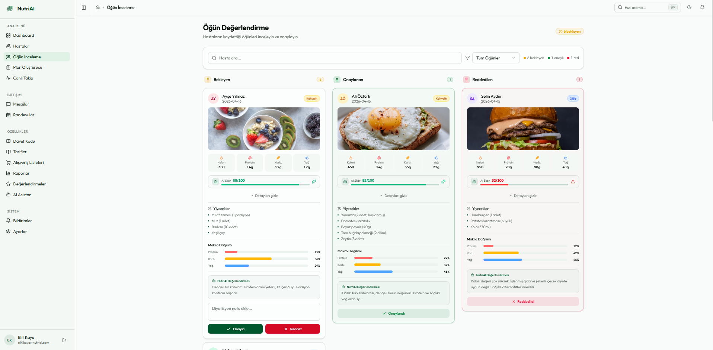

<div align="center">
  

  <h1>NutriAI</h1>

  <p><strong>An AI-powered nutrition tracking platform that bridges dietitians and their clients.</strong></p>

  <p>
    
    
    
    
    
    
    
  </p>
</div>

---

## Table of Contents

- [Overview](#overview)
- [Features](#features)
- [Screenshots](#screenshots)
- [Architecture](#architecture)
- [Tech Stack](#tech-stack)
- [Getting Started](#getting-started)
- [Project Structure](#project-structure)
- [Backend API Routes](#backend-api-routes)
- [Development Notes](#development-notes)
- [License](#license)

---

## Overview

**NutriAI** is a full-stack nutrition tracking platform that centralizes communication between dietitians and their clients. Patients can photograph their meals from a mobile app and automatically extract macro values via AI; dietitians monitor patient progress, build meal plans, and chat in real time through a web panel.

The system has three main components:

| Component | Target User | Technology |
| --- | --- | --- |
| 📱 **Mobile app** | Patient (client) | React Native + Expo |
| 🖥️ **Web panel** | Dietitian | React + Vite + Tailwind + shadcn/ui |
| ⚙️ **Backend API** | Both | Node.js + Express + PostgreSQL + Socket.io |

> The product UI is localized in Turkish (Turkish health-tech market); screenshots reflect this. The codebase, docs, and APIs are in English.

---

## Features

### 🤖 Artificial Intelligence
- **Meal photo analysis** — Identifies foods from a patient's photo with Gemini 2.5 Flash, estimates portion size and macros (calories / protein / carbs / fat).
- **Barcode scanning** — Maps packaged products to the food database via barcode.
- **AI Assistant** — Context-aware chat assistant for dietitians; generates suggestions and summaries using patient data.

### 📱 Mobile (Patient)
- Onboarding flow and dietitian linking via invite code
- Meal logging: photo, barcode, voice note, manual search
- Daily calorie / macro summary, progress charts
- Real-time messaging with the dietitian (Socket.io)
- Meal plan view, appointment management
- Allergy and food intolerance tracking
- Family link (multi-profile support)
- Progress photos, body measurement tracking

### 🖥️ Web (Dietitian)
- Patient management (list + detailed view)
- Drag-and-drop weekly meal plan builder
- Meal review & approval panel for patient logs
- Live tracking, appointment calendar, video call integration (skeleton)
- Automatic shopping list generation
- PDF report export (jsPDF + html2canvas)
- Recipe library
- Notification center
- Gamification (badges, achievements)
- Dark / light theme

### 🔐 Infrastructure
- JWT access + refresh token based authentication
- Role-based authorization (`patient`, `dietitian`, `admin`)
- Express rate limiting + Helmet
- Structured logs with Pino
- End-to-end type-safe validation with Zod
- One-command spin-up with Docker Compose

---

## Screenshots

### Mobile App (Patient)

<table>
  <tr>
    <td align="center" width="33%">
      
      <br /><sub><b>Welcome screen</b></sub>
    </td>
    <td align="center" width="33%">
      
      <br /><sub><b>Meal photo / barcode scan</b></sub>
    </td>
    <td align="center" width="33%">
      
      <br /><sub><b>Daily meals & macro summary</b></sub>
    </td>
  </tr>
</table>

### Web Panel (Dietitian)

<p align="center">
  
  <br /><sub><b>Dashboard</b> — today's appointments, weekly calorie trend, macro distribution</sub>
</p>

<p align="center">
  
  <br /><sub><b>Plan Creator</b> — design weekly meal plans with drag-and-drop</sub>
</p>

<p align="center">
  
  <br /><sub><b>Meal Review</b> — approve / reject the patient's daily meals</sub>
</p>

---

## Architecture

```
┌───────────────────────┐         ┌───────────────────────┐
│  📱 Mobile (Expo)     │         │  🖥️ Web (Vite/React)   │
│   React Native        │         │   shadcn/ui + Tailwind │
│   Zustand + Axios     │         │   Zustand + Axios      │
└─────────┬─────────────┘         └─────────┬─────────────┘
          │                                  │
          │  HTTPS (REST)  +  Socket.io (WS) │
          └──────────────┬───────────────────┘
                         │
                ┌────────▼─────────┐
                │   Backend API    │
                │  Express + TS    │
                │  JWT, Zod, Pino  │
                └────────┬─────────┘
                         │
              ┌──────────┴───────────┐
              │                      │
      ┌───────▼────────┐    ┌────────▼─────────┐
      │  PostgreSQL 16 │    │  Gemini 2.5 AI   │
      │  (raw SQL +    │    │  (photo analysis │
      │   pg driver)   │    │   + assistant)   │
      └────────────────┘    └──────────────────┘
```

---

## Tech Stack

### Backend
- **Runtime:** Node.js 20, TypeScript 5.9
- **Framework:** Express 4
- **Database:** PostgreSQL 16 (raw SQL, `pg` driver — no ORM)
- **Auth:** `jsonwebtoken` + `bcrypt`
- **Validation:** Zod
- **Realtime:** Socket.io 4
- **AI:** Google Gemini 2.5 Flash (REST API)
- **Security:** Helmet, express-rate-limit, CORS allowlist
- **Logging:** Pino + pino-http
- **File uploads:** Multer (meal photos)
- **Testing:** Jest + Supertest

### Web
- **Build:** Vite 7
- **UI:** React 19 + TypeScript 5.9
- **Styling:** Tailwind CSS 4 + shadcn/ui (Radix-based)
- **State:** Zustand 5
- **Forms:** React Hook Form + Zod resolver
- **Routing:** React Router 7
- **Charts:** Recharts 3
- **Drag-and-drop:** @hello-pangea/dnd
- **PDF:** jsPDF + html2canvas
- **Toasts:** Sonner
- **Theme:** next-themes (dark/light)

### Mobile
- **Framework:** Expo SDK 54 (React Native 0.81)
- **Navigation:** React Navigation 7 (stack + bottom tabs)
- **State:** Zustand 5
- **Storage:** AsyncStorage
- **Media:** expo-image-picker (camera + gallery)
- **Animation:** Reanimated 4
- **Realtime:** socket.io-client

### Infrastructure
- Docker + Docker Compose
- GitHub Actions CI (backend type-check + tests, web build)
- Railway-ready (backend deploy config included)
- Vercel-ready (web deploy config included)

---

## Getting Started

### Prerequisites
- **Node.js 20+**
- **Docker Desktop** (easiest path)
- **A Gemini API key** — free from [Google AI Studio](https://aistudio.google.com/apikey)

### 1. Clone the repository

```bash
git clone https://github.com/<your-user>/nutriai.git
cd nutriai
```

### 2. Configure environment variables

```bash
cp .env.example .env
# Open .env and fill in GEMINI_API_KEY and the JWT secrets
```

> Generate a JWT secret with: `openssl rand -hex 64`

### 3. Spin up backend + database (Docker)

```bash
docker compose up -d
```

This will:
- Start PostgreSQL on `localhost:5433`
- Load schema + seed data automatically
- Start the backend API on `localhost:3001`

Health check:

```bash
curl http://localhost:3001/api/health
# {"status":"ok"}
```

### 4. Start the web panel

```bash
cd web
npm install
npm run dev
# http://localhost:5173
```

### 5. Start the mobile app

```bash
cd mobile
npm install
npx expo start
```

When testing on a physical device, set `API_URL` inside `mobile/src/services/api.ts` to your machine's LAN IP (e.g. `http://192.168.1.4:3001/api`).

### Alternative: run the backend without Docker

```bash
cd backend
npm install
# export the .env vars or use a dotenv loader
npm run dev
```

> You will need to run PostgreSQL yourself and set `DATABASE_URL`.

---

## Project Structure

```
nutriai/
├── backend/                 Node.js + Express API
│   ├── src/
│   │   ├── routes/          19 route modules (auth, meal, ai, plan, ...)
│   │   ├── controllers/     HTTP handler layer
│   │   ├── services/        Business logic layer
│   │   ├── middleware/      auth, validate, rate-limit
│   │   ├── db/              SQL schema, seed files, query client
│   │   ├── socket/          Socket.io event handlers
│   │   ├── lib/             Logger, AI client
│   │   └── app.ts           Express bootstrap
│   ├── __tests__/           Jest integration tests
│   └── Dockerfile
│
├── web/                     React + Vite dietitian panel
│   ├── src/
│   │   ├── pages/           20+ pages (dashboard, patients, plan-creator, ...)
│   │   ├── components/      Reusable UI + feature components
│   │   ├── layouts/         App / Auth layouts
│   │   ├── routes/          React Router configuration
│   │   ├── services/        Axios-based API clients (one per route)
│   │   ├── stores/          Zustand stores (auth, ui, ...)
│   │   └── hooks/           Custom React hooks
│   └── vercel.json
│
├── mobile/                  Expo + React Native patient app
│   ├── src/
│   │   ├── screens/         Onboarding, home, meals, camera, messages, ...
│   │   ├── navigation/      Stack + bottom tabs
│   │   ├── components/      Shared RN components
│   │   ├── services/        API clients
│   │   ├── stores/          Zustand stores
│   │   ├── theme/           Design tokens
│   │   └── i18n/            Turkish / English localization
│   └── app.json
│
├── shared/                  Shared TS types across web + mobile
│   └── types/
│
├── docs/screenshots/        Images used in the README
├── docker-compose.yml       One-command local environment
├── .env.example             Environment variable template
└── .github/workflows/ci.yml GitHub Actions
```

---

## Backend API Routes

All routes are served under the `/api` prefix.

| Route | Responsibility |
| --- | --- |
| `POST /api/auth/*` | Sign-up, login, token refresh, password reset |
| `GET/POST /api/meals` | Patient meal logs (CRUD) |
| `POST /api/ai/analyze-meal` | AI meal extraction from a photo |
| `POST /api/ai/chat` | Dietitian AI assistant chat |
| `POST /api/ai/barcode` | Barcode → product lookup |
| `GET/POST /api/plans` | Meal plan CRUD |
| `GET/POST /api/patients` | Dietitian's patient management |
| `GET/POST /api/dietitians` | Dietitian profile & invite code |
| `GET/POST /api/appointments` | Appointment management |
| `GET/POST /api/messages` | Chat (real-time via Socket.io) |
| `GET/POST /api/notifications` | Notification center |
| `GET/POST /api/recipes` | Recipe library |
| `GET/POST /api/shopping` | Shopping lists |
| `GET/POST /api/reports` | PDF report generation |
| `GET/POST /api/reviews` | Dietitian reviews |
| `GET/POST /api/tracking` | Weight / measurement tracking |
| `GET/POST /api/progress-photos` | Progress photos |
| `GET/POST /api/family` | Family linking |
| `GET/POST /api/allergens` | Allergies / intolerances |
| `GET /api/foods` | Food database search |
| `GET/POST /api/gamification` | Badges and achievements |
| `* /api/admin/*` | Admin panel endpoints |

---

## Development Notes

### Database

Schema, seed and sample data live under `backend/src/db/` as plain SQL. These files run automatically the first time the container boots. To reset the schema:

```bash
docker compose down -v   # drops the volume
docker compose up -d     # reloads schema + seed
```

### Type-check

```bash
# Backend
cd backend && npm run typecheck

# Web
cd web && npm run build   # build includes tsc -b
```

### Tests

```bash
cd backend && npm test
```

### CI

GitHub Actions runs on every push or PR to `main`:
- Backend: TypeScript type-check + Jest tests (against a real PostgreSQL service)
- Web: Production build (type-check included)

### Security

- Secrets are read only from `.env`; they are never committed (covered by `.gitignore`)
- No hardcoded secrets in Docker Compose — the container won't start without an `.env`
- Use a different, strong random value for JWT secrets in every environment
- Production hardening still on the to-do list: HTTPS termination, refresh-token rotation, audit logging

---

## License

[MIT](./LICENSE) — free to use, modify, and distribute.
